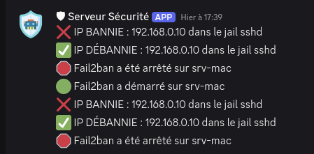
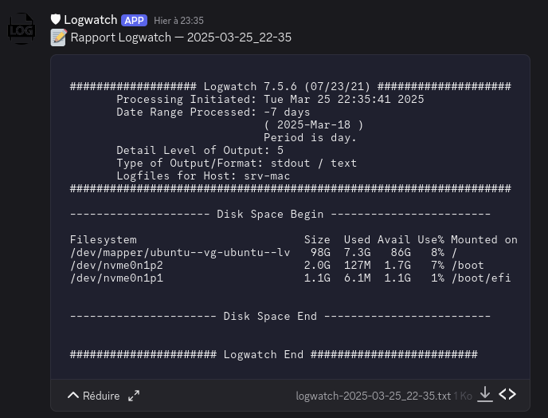
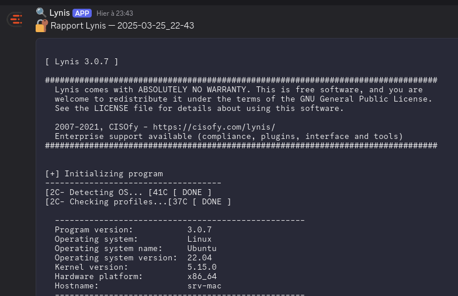

# SRV-MAC Project

## Description

Je réalise un projet pour créer mon propre serveur. Le but est d'heberger dessus différents service que je vais self host. 

## Setup du PC

### Installation de l'OS

Comme OS j'ai choisi Ubuntu Server 22.04.05 LTS. Je l'ai choisi car j'ai l'habitude de travailler avec Ubuntu et que c'est une distribution qui est très bien documentée.

### Connexion SSH

Pour une connexion securisé je vais utiliser SSH. Pour cela j'ai généré une paire de clé SSH sur mon PC et je l'ai ajouté sur le serveur. J'ai desactivé la connexion par mot de passe pour plus de sécurité. L'ensemble des règles est défini dans le fichier [`/etc/ssh/sshd_config`](./configs/sshd_config.txt).

### Pare-feu (UFW)

Pour sécuriser mon serveur j'ai mis en place un pare-feu avec UFW. J'ai autorisé les ports 22 (SSH), 80 (HTTP) et 443 (HTTPS). J'ai bloqué les autres ports. 

### Fail2Ban

> Proteges le serveur des tentatives de connexion SSH abusives. 

J'ai mis des configuration plutôt classique. On peut les retrouver dans le fichier [`/etc/fail2ban/jail.local`](./configs/jail.local).

J'ai également créer un WebHook discord dans lequel je reçois les alertes de fail2ban. Le script [`discord-alert.sh`](./scripts/discord-alert.sh) permet d'envoyer les alertes sur discord. Et on utilise le fichier [`/etc/fail2ban/action.d/discord.conf`](./configs/discord.conf) pour configurer l'envoie des alertes sur discord.

### Logwatch

> Envoie un résumé des logs

J'ai installé logwatch pour recevoir un résumé des logs via discord. Pour cela j'ai créé un script [`discord-logwatch.sh`](./scripts/discord-logwatch.sh) qui permet d'envoyer les logs sur discord. 

### Lynis

> Audite la sécurité du serveur

J'ai installé Lynis pour auditer la sécurité du serveur. J'ai créé un script [`discord-lynis.sh`](./scripts/discord-lynis.sh) qui permet d'envoyer les résultats de l'audit sur discord.

